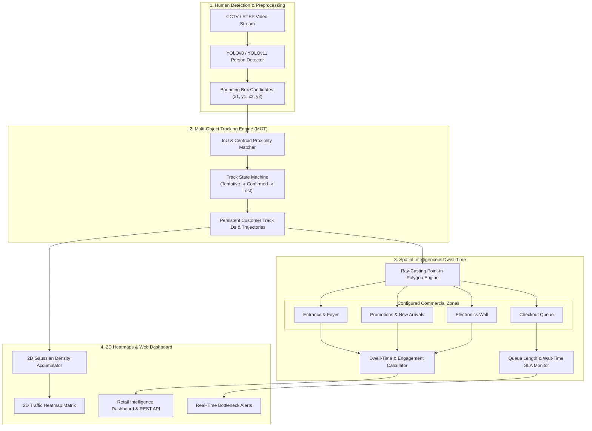

# Architectural Design: Smart-Store-Analytics (Vision AI & Retail Spatial Intelligence)

Author: Ahmed Khaled (Ahmed Algendy)  
Email: contact@ahmedalgendy.com  
GitHub: [https://github.com/AhmedKhalid0](https://github.com/AhmedKhalid0)  
Website: [https://ahmedalgendy.com](https://ahmedalgendy.com)  

---

## 1. System Overview

**Smart-Store-Analytics** is a production-grade Computer Vision and Retail Spatial Intelligence platform. It transforms raw commercial CCTV and video streams into real-time operational insights, tracking individual customer footfall, zone-by-zone dwell time, spatial traffic heatmaps, and checkout queue bottlenecks without storing identifying biometrics.

---

## 2. Core Architectural Pillars

### 2.1 Multi-Object Tracking (MOT) (`src/smart_store_analytics/core/tracking_engine.py`)
* **Trajectory Persistence**: Maintains smooth 2D centroid paths using IoU thresholding ($0.30$) combined with Euclidean proximity fallback ($80\text{px}$) to prevent ID switches during minor occlusions.
* **Track Lifecycles**: Transitions through `TENTATIVE` (requires $\ge 2$ frame hits) to `CONFIRMED`, marking unobserved tracks as `LOST` and pruning after 30 frames.

### 2.2 Spatial Zone Analytics (`src/smart_store_analytics/core/spatial_analytics.py`)
* **Ray-Casting Algorithm**: Employs point-in-polygon math to verify whether a customer's ground contact point $(cx, y2)$ resides inside defined store zones.
* **Dwell-Time Estimation**: Aggregates continuous session timers per zone with sub-second accuracy.

### 2.3 2D Spatial Heatmaps (`src/smart_store_analytics/core/heatmap_generator.py`)
* **Gaussian Density Accumulator**: Maps $(x, y)$ coordinates into a discrete spatial grid $(128 \times 72)$ applying exponential kernel spreads to highlight hotspots.
* **Turbo/Plasma Colormap**: Renders colorized 24-bit RGB images (Dark Blue $\to$ Cyan $\to$ Yellow $\to$ Red).

### 2.4 Queue Bottleneck Monitor (`src/smart_store_analytics/core/queue_monitor.py`)
* Automatically detects when checkout zone occupancy exceeds maximum capacity ($\ge 5$ customers) or wait time exceeds SLA ($\ge 180\text{s}$), emitting priority operational recommendations.

---

## 3. Communication Protocols & REST API

| Endpoint | Method | Purpose | Response Schema |
| :--- | :--- | :--- | :--- |
| `/api/v1/health` | `GET` | Vision detector and zone configuration telemetry | `HealthResponse` |
| `/api/v1/analytics/stats` | `GET` | Real-time footfall, zone dwell-times, and queue alerts | `AnalyticsResponse` |
| `/api/v1/analytics/simulate`| `POST` | Trigger fresh video stream trajectory simulation | `AnalyticsResponse` |
| `/api/v1/heatmap` | `GET` | Normalized 2D density grid matrix | `HeatmapResponse` |
| `/api/v1/heatmap/image` | `GET` | Colorized RGB PPM spatial heatmap image | File download (`image/x-portable-pixmap`) |
| `/` | `GET` | Interactive Retail Intelligence Dashboard | HTML / CSS / JS |
